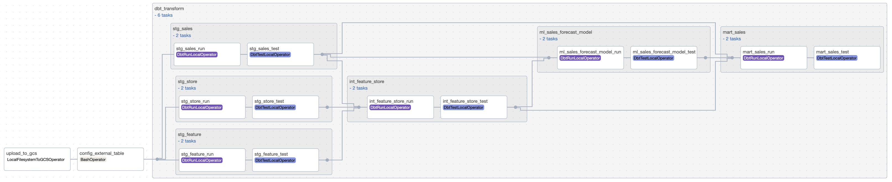
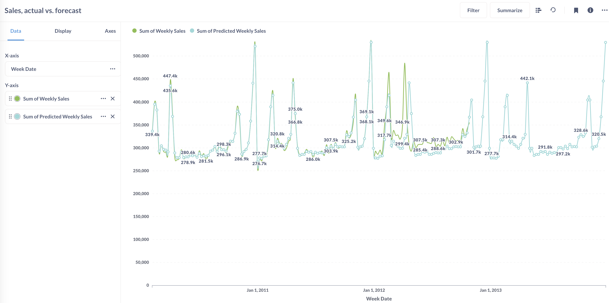
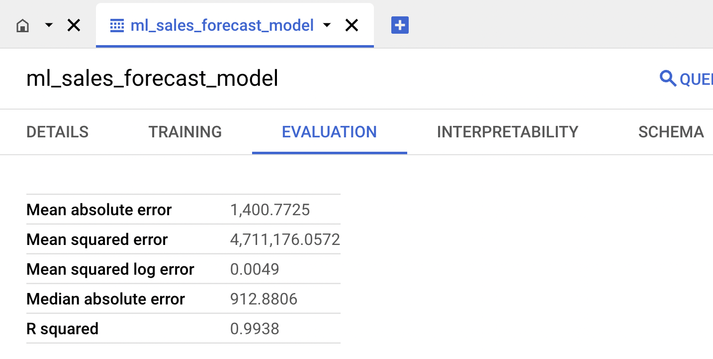

# Introduction

Airflow dbt project is a POC to showcase what Airflow, dbt and BigQuery can do together. The project has two main examples, one is about sale forecast pipeline and another is about customer churn analysis.


# Usage
1. Clone the repository, ensure that you are in the root folder of the project:
    ```
    git clone https://github.com/hung-il/airflow-cosmos-ml-demo.git
2. Start to build the image, with necessary requirements:
    ```
    docker-compose build
    ```
3. Start the containers:
    ```
    docker-compose up -d
    ```
4. Open the Airflow UI in your browser: http://localhost:8080
5. Turn on the DAGs and trigger them manually.


# Sales Forecast Pipeline
The pipeline is about forecasting the sales of a company. The data is from Kaggle: https://www.kaggle.com/datasets/manjeetsingh/retaildataset?resource=download.


## The data pipeline
Composed of 4 steps:
1. Load the dataset (already included in the repo) to GCS (Google Cloud Storage)
2. Map the GCS data to BigQuery
3. Run dbt to transform the data



## Visualizations with metabase
Metabase is already config in docker-compose.yml. Open the metabase UI in your browser: http://localhost:3000.
* choose create a Visualisation,
* in X-axis choose Week Date (our finest granularity is week),
* in Y-axis choose Weekly Sales and Predicted Weekly Sales, type is sum



# Appendix
### GCP setup (WIP)
### dbt profile setup (WIP)
### Airflow Gcloud connection setup (WIP)
### ML feature engineering
We use native BigQuery ML to do the feature engineering. The sematic layer for feature store can be accessed in [Feature store link](/include/dbt/models/sales_forecast/int/int_feature_store.sql).
### ML model training
The model type is Boosted Tree Regressor (another distribution of XGB by Google). The model training can be accessed in [Model training link](/include/dbt/models/sales_forecast/ml/ml_sales_forecast_model.sql).

Modle config:
```
config(
    materialized='model',
    ml_config={
        'model_type': 'BOOSTED_TREE_REGRESSOR',
        'BOOSTER_TYPE': 'GBTREE',
        'INPUT_LABEL_COLS': ['weekly_sales'],
        'MAX_ITERATIONS': 20,
        'L1_REG': 0.5,
        'L2_REG': 0.5,
        'SUBSAMPLE': 0.8,
        'DATA_SPLIT_METHOD': 'NO_SPLIT',
        'ENABLE_GLOBAL_EXPLAIN': True,
        'APPROX_GLOBAL_FEATURE_CONTRIB': True,
        'MAX_ITERATIONS': 30,
        'XGBOOST_VERSION': '1.1',
        'EARLY_STOP': True,
    }
)
```
Model evaluation:


